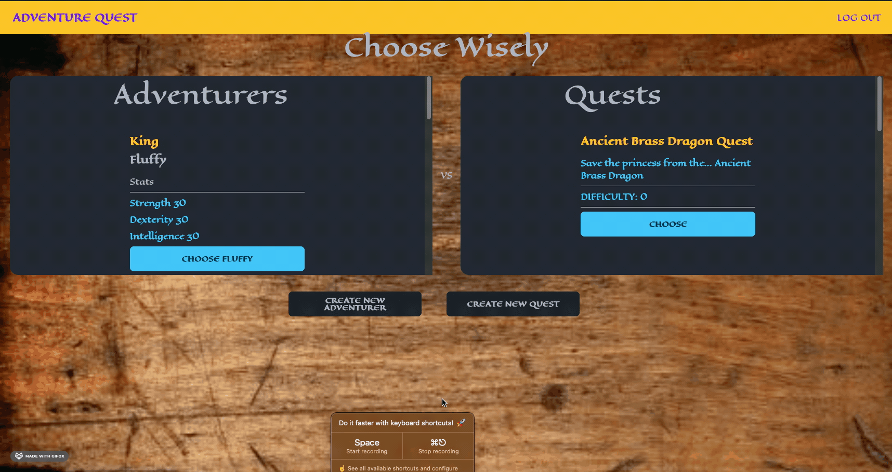

# adventureQuest

## Description

Have you ever found yourself unable to find an outlet for your imagnination?

Maybe you wish to delve deep into the imagination of another.

If so then this app is for you!

Adventure Quest is a single player high fantasy data driven user experience.

Whether you are an Adventurer seeking a Quest or a Questmaster seeking an Adventurer, this is an app within which you can loose yourself to fantasy!


## Link to Deployed Application

[Click to view the deployed application](https://warm-falls-71074.herokuapp.com/)



## Table of contents

- [Technologies Employed](#technologies-employed)
- [Key Functions](#key-functions)
- [Final Product](#final-product)
- [License](#license)
- [Contact/Questions](#questions)
- [Summary](#summary-and-learning-points)

## Technologies Employed

| Techlogy             | Implementation/Use       |
| -------------------- | ------------------------ |
| Node.js              | JavaScript runtime       |
| Node Package Manager | Manage node packages     |
| dotenv               | Environment Variables    |
| Express.js           | Web framework            |
| sequelize            | ORM                      |
| bcrypt               | password encryption      |
| Heroku               | Deployment               |
| Handlebars           | Template and View engine |

## Key Functionality

### adventureQuest

A client side function, listening for a click event, that makes a request to the sever, which in turn queries the database.
It was particularly interesting because we used the URL to give the primary key for the "AdventureQuest" that was creted.

```javascript
adventureQuest.on("click", async () => {
  aid = await getAid();
  qid = await getQid();
  const res = await fetch(`api/adventurequest`, {
    method: "POST",
    body: JSON.stringify({ adventurerId: aid, questId: qid }),
    headers: {
      "Content-Type": "application/json",
    },
  });
  if (res.ok) {
    res.json().then((data) => {
      const aq = data.pk.id;
      document.location.replace(`gameplay/${aq}`);
    });
  }
});
```

### Game Mechanics - The Brain

Once the Questmaster choses a quest and adventurer, the stats of the quest monster are calculated against the adventurer stats to determine one winner per battle.

We are comparing the Adventurer's stats to the Monsters.  This way either monster or adventurer have a legitimate advantage based on a particular strength or weakness.

We boil this comparison down to a fraction of 1 (or percentage), then apply class advantage, difficulty rating of the monster itself, and the monsters respective attribute.

```javascript
function gameMechanics(adventurer, quest) {
  var strWinPercentage = (adventurer.strength * adventurer.class.strMultiplier) / 100 + quest.difficulty + (0 - quest.monsterStr / 100);
  var dexWinPercentage = (adventurer.dexterity * adventurer.class.dexMultiplier) / 100 +  quest.difficulty + (0 - quest.monsterDex / 100);
  var intWinPercentage = (adventurer.intelligence * adventurer.class.intMultiplier) / 100 + quest.difficulty + (0 - quest.monsterInt / 100);
```

Once we have our fraction per stat, enter math random.

Math random chooses a number between 0 and 1 and our fraction acts as the over/under for our conditional statement.

So now we need to way to determine which stat we will use; enter math random again!  We use it to pick a number from 1 to 3 with each number representing a stat.  This all fits snuggly within a while loop that runs so long as both parties are alive.  Once someone dies, we have a winner and the loop exits.

```javascript
  while (monsterHitPoints > 0 && adventurerHitPoints > 0) {
    if (Math.random() < fightArray[i] + adventurerPower) {
      damage = Math.ceil(Math.floor((Math.random() * 3) + 1) + adventurerPower);
      damageString = damageString.concat(damage.toString() + '|');
      injuryString = injuryString.concat(' ' + '|');
      battleString = battleString.concat(dealtDamageArr[Math.floor((Math.random() * (dealtDamageArr.length - 1)) + 1)] + '|');
      monsterHitPoints = monsterHitPoints - damage;
      monsterHPStr = monsterHPStr.concat(monsterHitPoints.toString() + '|');
      adventurerHPStr = adventurerHPStr.concat(adventurerHitPoints.toString() + '|');
      if (i === fightArray.length - 1) {
        i = 0;
      } else {
        i = i + 1;
      }
    } else {
      injury = Math.ceil(Math.floor((Math.random() * 5) + 1) - adventurerPower);
      injuryString = injuryString.concat(injury.toString() + '|');
      damageString = damageString.concat(' ' + '|');
      battleString = battleString.concat(tookDamageArr[Math.floor((Math.random() * (tookDamageArr.length - 1)) + 1)] + '|');
      adventurerHitPoints = adventurerHitPoints - injury;
      adventurerHPStr = adventurerHPStr.concat(adventurerHitPoints.toString() + '|');
      monsterHPStr = monsterHPStr.concat(monsterHitPoints.toString() + '|');
      if (i === fightArray.length - 1) {
        i = 0;
      } else {
        i = i + 1;
      }
    }
  }
```

### router.get("/questBoard")

This was a key route in our program because it gets all data for the current users adventurers, as well as all quests
made by any QuestMaster registered on AdventureQuest. It then sends all of the information to the Handlebars template.

```javascript
router.get("/questBoard", auth, async (req, res) => {
  try {
    const questData = await Quest.findAll({
      order: [["created_at", "DESC"]],
    });

    const adventurerData = await Adventurer.findAll({
      include: [{ model: Class }],
      order: [["created_at", "DESC"]],
      where: { questMasterId: req.session.questMasterId },
    });

    //serializedata
    const quests = questData.map((quest) => quest.get({ plain: true }));
    const adventurers = adventurerData.map((adventure) =>
      adventure.get({ plain: true })
    );

    res.render("questBoard", {
      quests,
      adventurers,
      logged_in: req.session.logged_in,
    });
  } catch (err) {
    console.log("Error fetching data");
  }
});
```

## Final Product


## License

This software is licensed under the MIT [LICENSE](./LICENSE)

MIT License

Copyright (c) 2022 Brennan LeClair, Sid Quinsaat, Krystopher Quintero

Permission is hereby granted, free of charge, to any person obtaining a copy
of this software and associated documentation files (the "Software"), to deal
in the Software without restriction, including without limitation the rights
to use, copy, modify, merge, publish, distribute, sublicense, and/or sell
copies of the Software, and to permit persons to whom the Software is
furnished to do so, subject to the following conditions:

The above copyright notice and this permission notice shall be included in all
copies or substantial portions of the Software.

THE SOFTWARE IS PROVIDED "AS IS", WITHOUT WARRANTY OF ANY KIND, EXPRESS OR
IMPLIED, INCLUDING BUT NOT LIMITED TO THE WARRANTIES OF MERCHANTABILITY,
FITNESS FOR A PARTICULAR PURPOSE AND NONINFRINGEMENT. IN NO EVENT SHALL THE
AUTHORS OR COPYRIGHT HOLDERS BE LIABLE FOR ANY CLAIM, DAMAGES OR OTHER
LIABILITY, WHETHER IN AN ACTION OF CONTRACT, TORT OR OTHERWISE, ARISING FROM,
OUT OF OR IN CONNECTION WITH THE SOFTWARE OR THE USE OR OTHER DEALINGS IN THE
SOFTWARE.


## Questions?

Please visit our gitHubs

[Sid (sharkby7e)](https://www.github.com/sharkby7e)

[Krystopher (KrystopherQ)](https://github.com/KrystopherQ)

[Brennan (blec333)](https://github.com/Blec333)


## Summary and Learning Points

### Sid
This was an extremely fun application to build. Not only because of my team, but because we got to be creative. We had to find solutions to "problems" that we "created" ourselves, and I really enjoyed the process. I enjoyed working in a group, and definitely learned a lot about how I personally deal with teamwork.

### Brennan
This project was wonderfully collaborative.  It's success can be attributed in no small measure to our ability to work together as a team.  I was lucky to be able to work with these two on this project.  We kept the atmosphere light and fun, which I maintain contributed to our productivity.

### Acknowledgements

©Brennan LeClair
©Sid Quinsaat
©Krystopher Quintero
